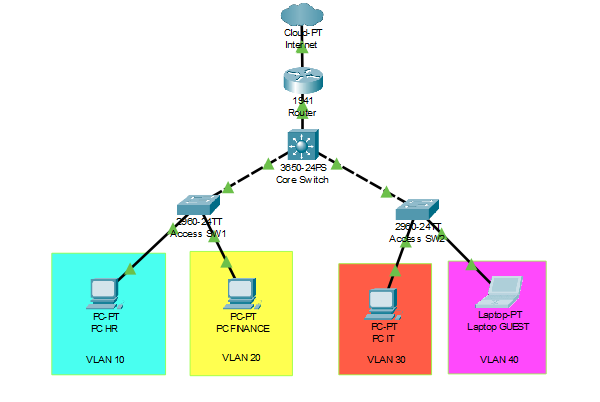
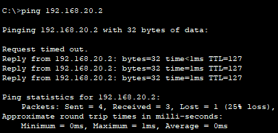
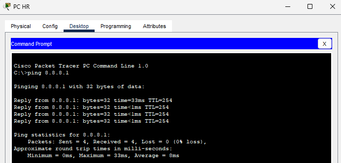

## Enterprise Campus Network Architecture

## Project Overview
Proyek ini adalah simulasi desain arsitektur jaringan *Enterprise* skala menengah yang dirancang menggunakan Cisco Packet Tracer. Tujuan utama proyek ini adalah membangun infrastruktur LAN (*Local Area Network*) yang aman, terukur (*scalable*), dan memiliki performa tinggi untuk mendukung operasional berbagai divisi dalam sebuah perusahaan, lengkap dengan konektivitas keluar menuju jaringan publik (Internet/Cloud).

## Core Technologies & Features Implemented
Proyek ini mendemonstrasikan implementasi standar industri melalui 5 pilar utama jaringan:
1. **Hierarchical Network Design (Collapsed Core):** Menggunakan arsitektur pemisahan *Access Layer* dan *Core/Distribution Layer* untuk meminimalisir *bottleneck* lalu lintas data.
2. **VLAN & Trunking (Security & Segmentation):** Memecah *broadcast domain* menjadi 4 area terisolasi (HR, Finance, IT, dan Guest) untuk mencegah kebocoran data.
3. **Layer 3 Switching & Inter-VLAN Routing (SVI):** Memanfaatkan *Multilayer Switch* (Core Switch) sebagai pusat *routing* internal yang menjamin komunikasi antar-divisi berlangsung cepat.
4. **DHCP Server Automation:** Konfigurasi *pool* IP otomatis terpusat di *Core Switch*.
5. **Static Routing & NAT Overload (PAT):** Mengimplementasikan *Network Address Translation* pada Router *gateway* untuk menerjemahkan IP Private menjadi IP Public.

## Network Topology
Berikut adalah rancangan topologi fisik dan logis dari jaringan ini:

## IP Subnetting Plan (CIDR /24)
| Divisi / VLAN | Network Address | Rentang IP Tersedia | Broadcast Address | Default Gateway |
| :--- | :--- | :--- | :--- | :--- |
| HR (VLAN 10) | 192.168.10.0 | 192.168.10.2 - 254 | 192.168.10.255 | 192.168.10.1 |
| FINANCE (VLAN 20)| 192.168.20.0 | 192.168.20.2 - 254 | 192.168.20.255 | 192.168.20.1 |
| IT (VLAN 30) | 192.168.30.0 | 192.168.30.2 - 254 | 192.168.30.255 | 192.168.30.1 |
| GUEST (VLAN 40) | 192.168.40.0 | 192.168.40.2 - 254 | 192.168.40.255 | 192.168.40.1 |

##  Testing & Verification
Berikut adalah dokumentasi pengujian konektivitas yang memastikan arsitektur berjalan sesuai desain:

**1. Inter-VLAN Routing Test**
*Bukti bahwa PC antar divisi (beda subnet) berhasil berkomunikasi melalui Multilayer Switch tanpa hambatan:*

**2. NAT & External Routing Test**
*Bukti bahwa Router berhasil menerjemahkan IP Private menjadi IP Public (NAT Overload) dan menjangkau Internet/Cloud:*

